<h1 align="center">
  ✨ 
  Hi, I'm Ayush Tiwari 
  ✨
</h1>
<h3 align="center" style="font-weight:500">
  Bioengineer × Developer from India 🇮🇳
</h3>

  

---

## 🧪 Current Projects

| Project | Description | Status |
|---------|-------------|--------|
| **🌱 Soil Microbiome** | Microbial solutions for agriculture | `Research Phase` |
| **🏥 Language Converter and Image Text generation** | Next Js + Generative AI | `Developed` |
| **🏥 Hospital System** | Next Js | `Live Soon` |
| **🛒 Eco-Ecommerce** | Next.js sustainable marketplace | `Live Soon` |

[↗ View All Projects](https://github.com/ayushtiwari2105G)

---

## 🛠️ Tech Stack

```mermaid
%%{ init : { "theme" : "base", "flowchart" : { "curve" : "basis" }}}%%
graph TD
  A[🖼️ Frontend] --> B[⚛️ React]
  A --> C[🔗 Next.js]
  A --> D[🎞️ GSAP]
  A --> E[🎨 Tailwind CSS]
  A --> F[🎨 Acertinity]

  G[🛠️ Backend] --> H[🌐 Node.js]
  G --> I[🍃 NEXT.js]
  G --> J[🍃 MongoDB]

  V[🔬 Science & Research] --> W[📊 MATLAB]
  V --> X[🧬 BioPython]
  V --> Y[🖼️ ImageJ]
  V --> Z[🧪 PCR, DNA Isolation]
  V --> AA[🌾 Microbe–Nano Consortia]

  style A fill:#b4e7f8,stroke:#333,stroke-width:1px
  style G fill:#c5edcc,stroke:#333,stroke-width:1px
  style V fill:#f9e2b5,stroke:#333,stroke-width:1px

```

---

### 👯 Let’s Collaborate On:
- 🤖 AI-powered apps with impact  
- 🌱 Open-source bio-agriculture tools

### 🤝 Looking for Help With:
- 🧪 **Microbe + Nanoparticle Consortia** for sustainable farming  
  [`Join Research`](https://github.com/ayushtiwari2105G)

---

### 🌱 Currently Learning:
`Generative AI`, `Framer Motion`, `Tailwind`, `MongoDB`, `MATLAB DSP`, `Pandas`, `Hugging Face`

---

### 💬 Ask Me About:
`React`, `Vue`, `GSAP`, `Bioinformatics`, `MATLAB`, `GreenTech`

---

### 📫 Reach Me At:
[📧 Email](mailto:ayushtiwari2105g@gmail.com) | [📍 Katni, India](https://goo.gl/maps/)

---

### 👨‍💻 All Projects:
🌐 [Portfolio – Coming Soon](https://github.com/ayushtiwari2105G)

### 📝 I Write Articles On:
📰 [Blog – Coming Soon](https://github.com/ayushtiwari2105G)

### 📄 Know My Journey:
📜 [Resume (PDF)](https://github.com/ayushtiwari2105G/Ayush-tiwari-Resume)

---

### ⚡ Fun Fact:
> _"I think I’m funny... and sometimes my code agrees 😄"_

---

## 🛠️ My Developer Toolbox

| Languages | Frontend | Backend | AI / Data | Tools | Science |
|----------|----------|---------|-----------|-------|---------|
| `Java`, `JS`, `Python` | `React`, `Next.js`, `Vue`, `GSAP`, `Tailwind`, `Bootstrap` | `Node.js`, `Express.js`, `MongoDB`  | `Postman`, `Git`, `VSCode` | `PCR`, `DNA Isolation`, `DSP`, `MATLAB` |

---

## 📊 GitHub Stats (3D Mode ⚙️)

  
  

  

---

## 🏆 GitHub Achievements

  

---

## 🌐 Let's Connect

  
  
  
  

---

## ☕ Support My Journey

  

---

> _“Stay curious, build passionately, and solve meaningfully.”_  
> — Ayush 🌱✨
